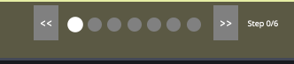
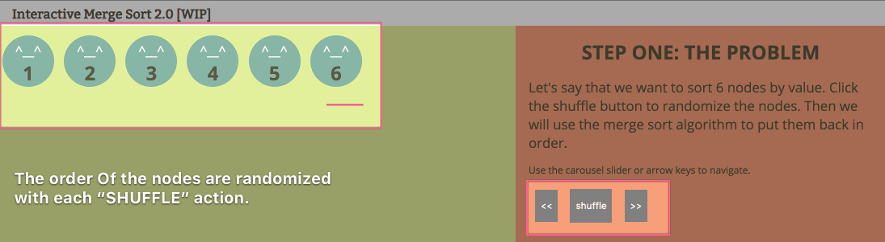
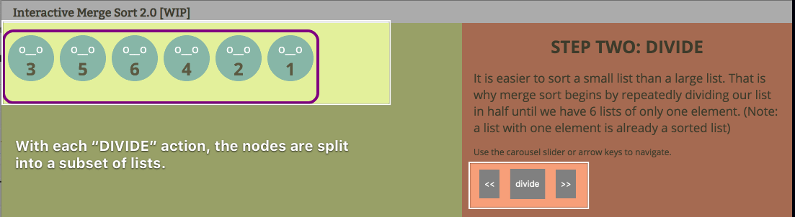
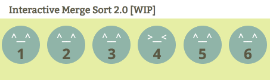

# Merge Sort Interactive
Interactive Merge Sort 2.0 is a revisit of an old project I did when I was first learning web dev. Now that its been 4 years I wanted to recreate the app. If you don't want to fork this front end code, just check out the WORK IN PROGRESS remake here:
https://codepen.io/0xbri/pen/KgrqXk?editors=1111 

## FEATURES

First thing is first. Who remembers the experience of learning sorting algorithms in a data structures class? If you’re like me, then you were sitting in a lecture hall of over 200 people listening to a professor excitedly make all sorts of lines all over a chalkboard. As the professor explains, you glance around, and everyone else in the room is stroking their chin and nodding, as if they fully understand. But you, you just don’t quite get it yet.
The merge sort algorithm is one of the first more structured and complicated algorithms that one goes through in a traditional Computer Science curriculum. If you are not quite used to recursive thought pattern or walking through code, it can be difficult to grasp. But once you have it, you are set to go!

Because I remember that it took a bit of time for me to understand, I was hoping to build a tool to help people grasp the concept of sorting algorithms. So as a learning exercise I devved up a web application.  The application that I made is an interactive educational module for Computer Science Students learning about data structures. My intentions were to present the concept of sorting in an easy to follow and colorful way.

### Slide State Management

### Shuffle

### Divide

### Sort [WIP]

### Merge (Combine) [WIP]

### Tickle

### TODO
* Complete Merge Step
* Fix Test Suite
